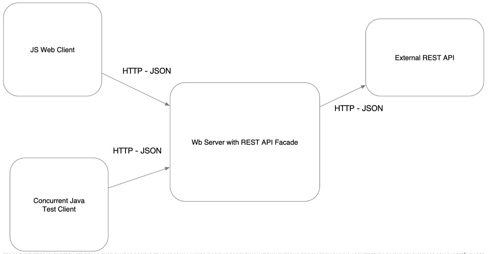

# Taller 1: Aplicaciones distribuidas
##  TALLER 1: APLICACIONES DISTRIBUIDAS (HTTP, SOCKETS, HTML, JS,MAVEN, GIT

Es una aplicación para consultar la información de películas de cine.  La aplicación recibirá una frase de búsqueda del título, por ejemplo “Guardians of the galaxy”  y deberá mostrar el los datos de la película correspondiente. Evita hacer consultas repetidas al API externo.Esta información es sacada del API gratuito https://www.omdbapi.com/.

## Authors

**Maria Juanita Oramas Bermudez**

---

### Instrucciones de uso
Para poder usar el proyecto lo primero que debe realizar es clonar este repositorio utilizando el siguiente comando desde la terminal del SO que este utilizando:
```
git clone https://github.com/JuanitaOramas/AREP_Taller01.git
```
Luego debe redirigirse por medio de la terminal al directorio raíz la cual contiene el achivo pom.xml.

Una vez se encuentre en este directorio se debe compilar el programa para esto se debe ejecutar el siguiente comando:
```
mvn package
```
Para verificar la integridad del código

---
### Prerrequisitos

El proyecto se hizo con Maven, para visualizarlo se debe tener un framework que permita la instalacion y visualizacion de esta.
Se debe verificar las versiones:

```
Java version: 1.8.0_341
git version 2.37.2.windows.2
maven

```

### Instalación

Para la instalación, se puede clonar este repositorio con:

```
git clone
```
---
## Running the tests

Para correr las pruebas se puede desde la terminal con el comando:

```
mvn test
```


## Deployment


Para la compilación del proyecto se usa el comando:
```
mvn install
```
---
## Design

### Arquitectura

Esta fue la arquitectura base utilizada:



### Patrones utlizados
* Servidor fachada
* MVC

**Cache**
Se creo una clase nueva para almacenar el cache, donde con un HashMap que va a guardar los datos que se consultan por primera vez, cuando se vuelva a consultar por el mismo dato no sera necesario hacer el llamado al API externo,  si no que se extraera el dato del HashMap.

**Extensibiliad**
Para ser extensible este código, se podría crear una clase que extienda de HttpConection y aquí  se pondría una nueva clase la implementación del nuevo API externo.

---
## Built With

* [Intellij](http://www.dropwizard.io/1.0.2/docs/) - The web framework used
* [Maven](https://maven.apache.org/) - Dependency Management


